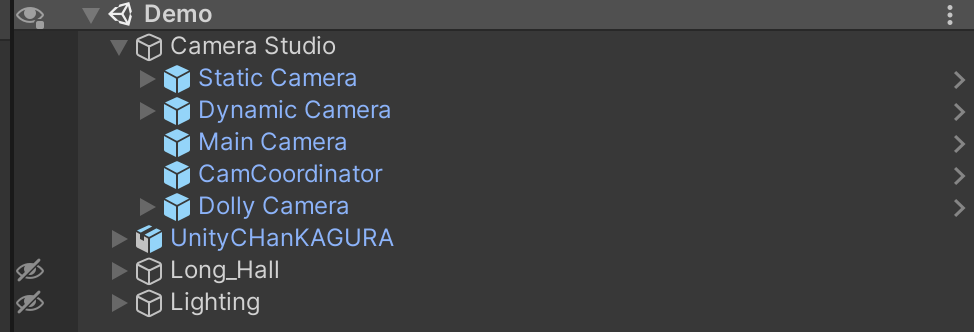
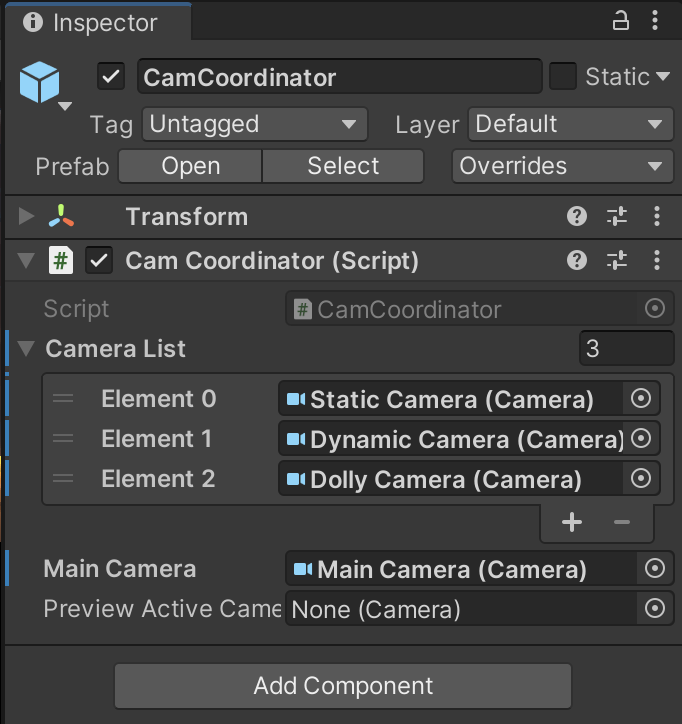
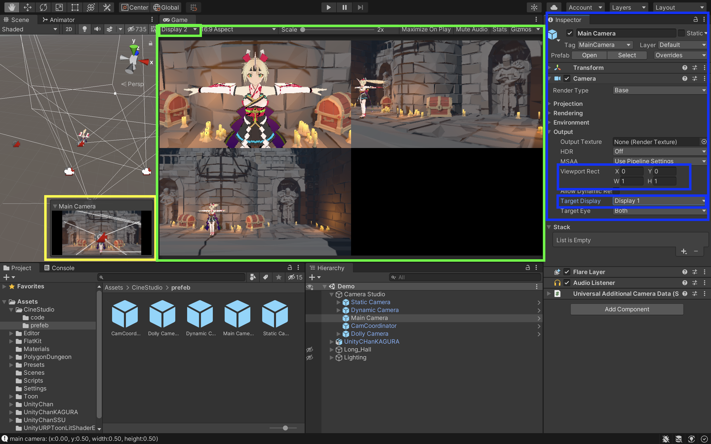

# Installation

## Prerequisites
[`Unity Cinemachine`](https://unity.com/unity/features/editor/art-and-design/cinemachine) has to be installed for you to be able to use Cam Studio.
- Use the Unity Package Manager (in the top menu: Window > Package Manager) to select Cinemachine for installation.

## Install project
To install Cam Studio:
1. In the Scene, create a `Cam Studio` Parent GameObject for better organization. This will contain all cameras we are going to create.
2. Add the following prefabs into the scene from [`prefab`](../CamStudio/prefab/)
    - Main Camera
    - CamCoordinator
    - ... and any camera you want to install
    
3. Under CamCoordinator object, locate the `main camera` and all cameras in `Camera List`
    - For camera, locate the `Camera` GameObject __**UNDER THE PREFAB, instead of the parent prefeb**__
    
4. For each camera, they should be with their own camera, so configuration has to be done for them:
    - Set the `layer` of game object to be exclude other camera, as the cinemachine brain will affect each other on the same plane. [Setting layer](https://docs.unity3d.com/Manual/Layers.html), [Setting layers](https://docs.unity3d.com/Packages/com.unity.cinemachine@2.6/manual/CinemachineMultipleCameras.html)
    - Set the `Target Display` of the `Camera` Component (not cinemachine virtual camera) to other display, while set display 1 for `Main Camera` __**ONLY**__
    - Set the `ViewPort` for the camera to create a demo multi-camera view
    After that, the setting should be simillar to this:
    
5. Thats it! you can modify the cinemachine virtual camera's property and the camera should be ready to use!
