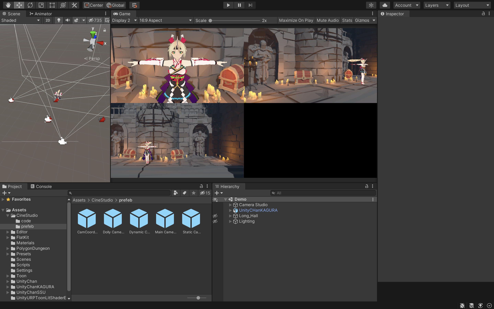

# Cam Studio
Cam Studio is a library for camera coordination, made for virtual stage in unity.

## Demo
The output can support support several displays, with its own camera scene

[Youtube Demo](https://youtu.be/FwJzL46QnvU)

## RoadMap
Currently this project is in its 0.1 beta stage, the following stages are planned to develop:
1. Create a minimum workable product 
2. Refactor the code so it can be imported as a library, with some prefabs ready to be used
3. Create a workable project that can be downloaded and use directly **<-- current stage**
4. Add support on different camera switching method, and rails
5. Add LAN support to use a special device/mobile phone to do remote control on the applications

## Docs
[Installation](./docs/installation.md)
[Usage](./docs/usage.md)

## Thanks
The development on the demo above uses [Unity-Chan Kagura](https://unity-chan.com/contents/news/unitychankagura/). Thanks for the wonderful model!